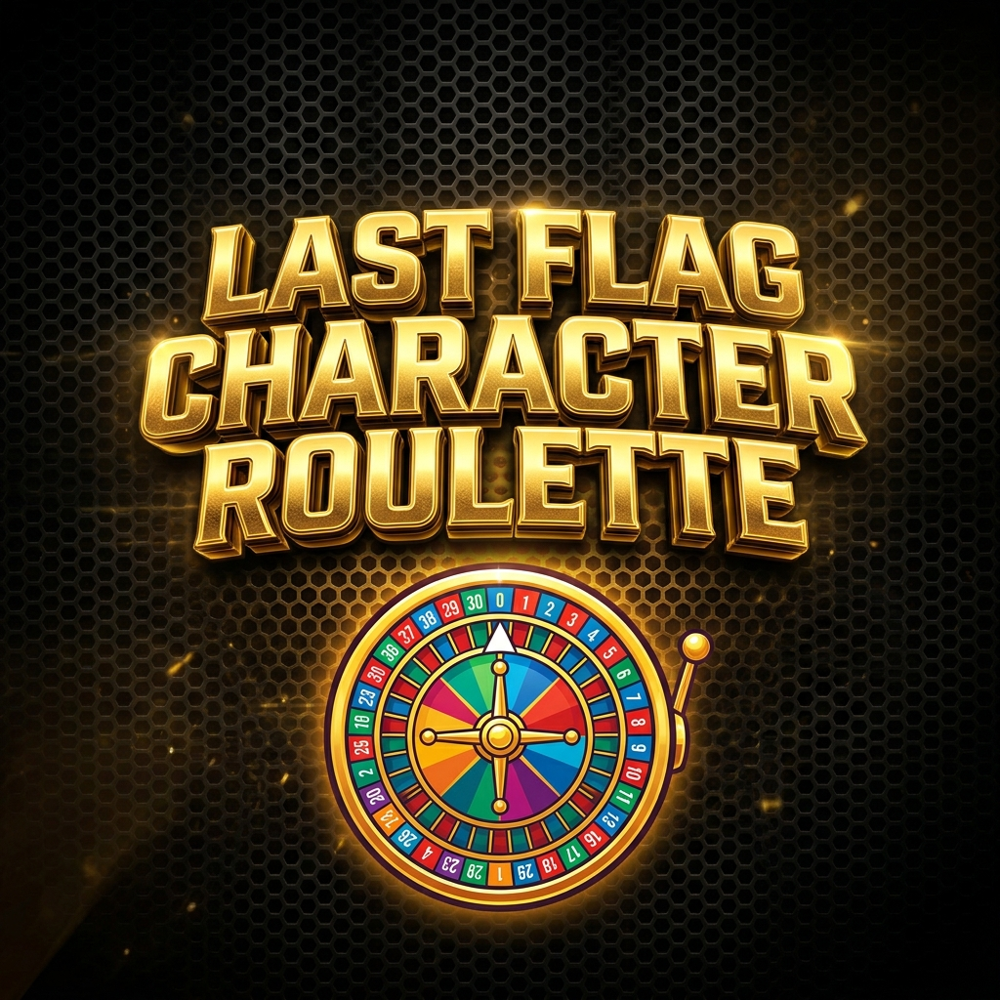

# 🎡 Last Flag – Character Roulette



A high-fidelity, interactive character selection tool designed for the **Last Flag** community. This web-based roulette provides a premium experience for players and streamers to randomly select their next contestant with style.

---

## 🚀 Features

- **Premium 3D Experience**: Cinematic 3D-styled typography and smooth, physics-based animations.
- **Dynamic Roulette Engine**: High-performance horizontal spinner powered by CSS transitions and requestAnimationFrame.
- **Official Character Roster**: Features 9 unique characters direct from the official Last Flag CDN.
- **Immersive Feedback**:
  - **Procedural Audio**: Real-time tick sounds and victory fanfares via Web Audio API.
  - **Confetti Celebration**: Custom canvas-based particle system for winner reveals.
- **Bilingual Support**: Instant toggle between **English** and **Spanish** with persistent user preference.
- **Control Panel**:
  - Toggle specific characters on/off.
  - View spin history.
  - Access official character profiles and lore.
- **Keyboard Shortcuts**: Use `Space` or `Enter` to spin, and `ESC` to close results.

## 🛠️ Built With

- **HTML5**: Semantic structure and SVG components.
- **Vanilla CSS**: Premium gaming aesthetics featuring glassmorphism, gradients, and custom animations.
- **Modern JavaScript**: Clean, modular logic for audio, particle physics, and state management.
- **Web Audio API**: Real-time synthesized sound effects.

## 📂 Project Structure

- `index.html`: Main application interface and metadata.
- `style.css`: All visual styling, responsive design, and animations.
- `script.js`: Core roulette engine, i18n logic, and audio systems.
- `og-image.png`: High-resolution social media preview asset.

## 🏁 Quick Start

1. **Clone the repository**:
   ```bash
   git clone https://github.com/PEIEE/lfroulette.git
   ```
2. **Open the project**:
   Simply open `index.html` in any modern web browser. No configuration or installation required.

## 🌐 Deployment

The project is ready for deployment on static hosting platforms like **GitHub Pages**, **Netlify**, or **Vercel**. 

To host on GitHub Pages:
1. Push your code to your repository.
2. Go to **Settings > Pages**.
3. Select the `main` branch and folder `/root`.
4. Your site will be live at `https://[username].github.io/lfroulette/`.

## 🛡️ License

This project is open-source and available under the **MIT License**.

---

*Made with ❤️ for the Last Flag community.*
